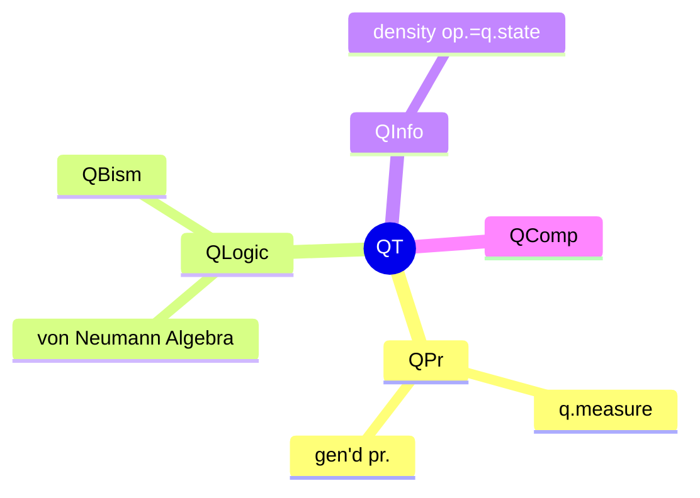

# 2024-02-11

양자역학 = 유니터리 연산자로 진행되는 stochastic process?
위 생각을 어떻게 수학화 할 것인가?

```mermaid
mindmap
 root((QT))
  QPr
   q.measure
   gen'd pr.
  QLogic
   von Neumann Algebra
   QBism
  QInfo
   density op.=q.state
  QComp
```
