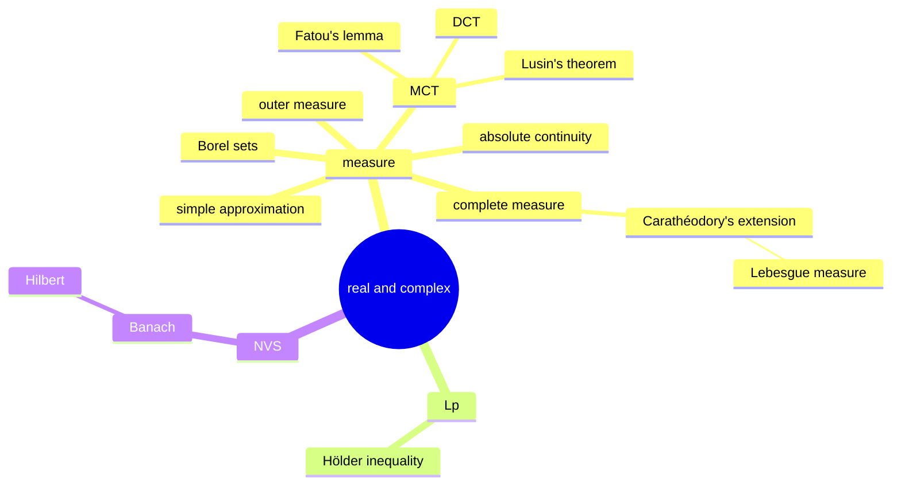

## TODO

## Mind Map

```mermaid
mindmap
 root((real and complex))
  measure
   Borel sets
   outer measure
   complete measure
    Carathéodory's extension
     Lebesgue measure
   simple approximation
   absolute continuity
   MCT
    Fatou's lemma
    DCT
    Lusin's theorem
  Lp
   Hölder inequality
  NVS
   Banach
    Hilbert
```

